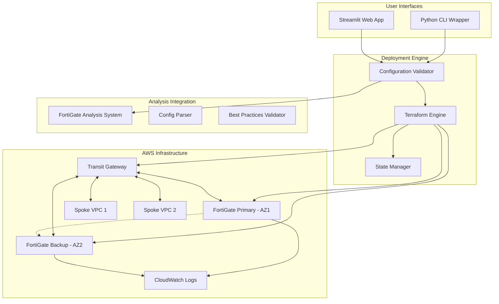
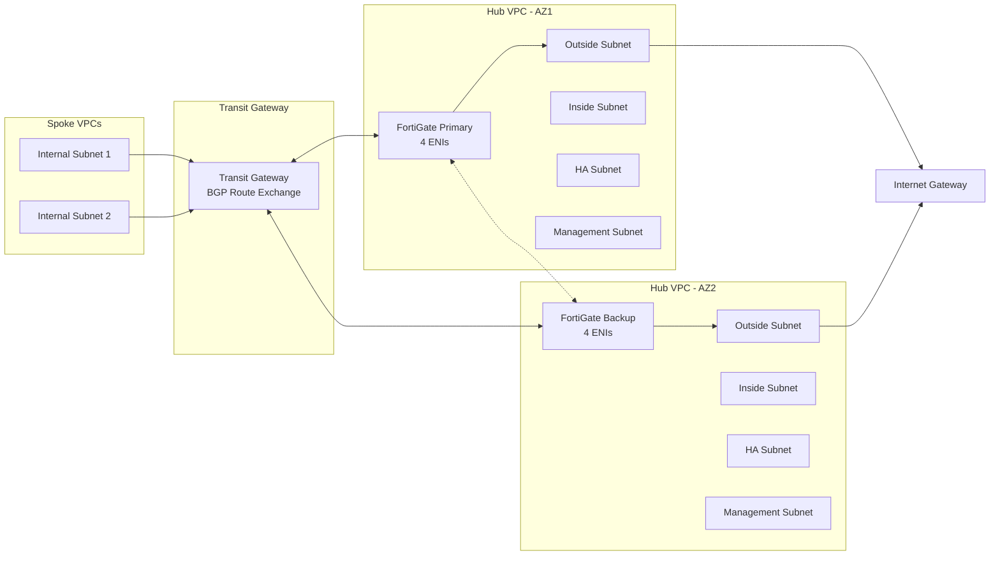

# Design Document: FortiGate AWS HA Deployment

## Overview

The FortiGate AWS HA Deployment system is a comprehensive infrastructure-as-code solution that automates the deployment of highly available FortiGate firewall pairs on AWS. The system implements a hub-and-spoke architecture using AWS Transit Gateway, with dynamic BGP routing, comprehensive monitoring, and both CLI and web-based interfaces for deployment management.

The solution consists of four main components:
1. **Terraform Infrastructure Modules** - Modular Terraform code for AWS resource provisioning
2. **Python Deployment Engine** - Interactive CLI wrapper with validation and state management
3. **Streamlit Web Frontend** - Web-based interface for deployment management
4. **Integration Layer** - Connects with existing FortiGate Terraform Analysis System

## Architecture

### High-Level Architecture



### Network Architecture



## Components and Interfaces

### 1. Terraform Infrastructure Modules

**Purpose**: Modular Terraform code for provisioning AWS resources with idempotent deployment capabilities.

**Key Modules**:
- `fortigate-ha`: Main module for FortiGate HA pair deployment
- `transit-gateway`: Transit Gateway configuration with BGP routing
- `networking`: VPC, subnets, and ENI management
- `security`: Security groups, NACLs, and IAM roles
- `monitoring`: CloudWatch logs, dashboards, and alarms

**Interfaces**:
```hcl
# Main module interface
module "fortigate_ha" {
  source = "./modules/fortigate-ha"
  
  # Network Configuration
  vpc_id                = var.vpc_id
  availability_zones    = var.availability_zones
  subnet_ids           = var.subnet_ids
  
  # FortiGate Configuration
  fortigate_ami_id     = var.fortigate_ami_id
  instance_type        = var.instance_type
  key_pair_name        = var.key_pair_name
  
  # HA Configuration
  ha_password          = var.ha_password
  admin_password       = var.admin_password
  
  # BGP Configuration
  bgp_asn              = var.bgp_asn
  transit_gateway_id   = var.transit_gateway_id
  
  # Monitoring
  enable_flow_logs     = var.enable_flow_logs
  log_retention_days   = var.log_retention_days
}
```

### 2. AMI Discovery System

**Purpose**: Automatically discovers FortiGate AMIs from AWS Marketplace with support for different versions and license types.

**Core Classes**:

```python
class AMIDiscovery:
    """Discovers FortiGate AMIs in AWS Marketplace"""
    
    def __init__(self, aws_session: boto3.Session):
        self.aws_session = aws_session
        self.ec2 = aws_session.client('ec2')
        self.fortinet_owner_id = "679593333241"  # Fortinet's AWS account
    
    def find_latest_ami(self, version: str, license_type: str, architecture: str = "x86_64") -> Optional[str]:
        """Find the latest FortiGate AMI matching criteria"""
        pass
    
    def list_available_versions(self) -> List[str]:
        """List available FortiGate versions"""
        pass
    
    def validate_ami_availability(self, ami_id: str) -> bool:
        """Validate AMI exists and is available"""
        pass

class AMIDiscoveryConfig:
    """AMI discovery configuration"""
    enabled: bool = True
    version: str = "7.4"
    license_type: str = "BYOL"  # BYOL, OnDemand, Reserved
    architecture: str = "x86_64"
```

### 3. License Management System

**Purpose**: Manages secure storage and retrieval of FortiGate licenses with support for AWS Secrets Manager and S3.

**Core Classes**:

```python
class LicenseManager:
    """Manages FortiGate license retrieval and application"""
    
    def __init__(self, aws_session: boto3.Session):
        self.aws_session = aws_session
        self.secrets_manager = aws_session.client('secretsmanager')
        self.s3 = aws_session.client('s3')
    
    def get_license_from_secrets_manager(self, secret_name: str) -> Optional[str]:
        """Retrieve license from AWS Secrets Manager"""
        pass
    
    def get_license_from_s3(self, bucket: str, key: str) -> Optional[str]:
        """Retrieve license from S3"""
        pass
    
    def validate_license_format(self, license_content: str) -> bool:
        """Validate FortiGate license file format"""
        pass
    
    def apply_license_to_instance(self, instance_id: str, license_content: str) -> bool:
        """Apply license to FortiGate instance"""
        pass

class LicensingConfig:
    """FortiGate licensing configuration"""
    type: str = "BYOL"  # BYOL, OnDemand, Reserved
    primary_license_secret: Optional[str] = None
    backup_license_secret: Optional[str] = None
    license_s3_bucket: Optional[str] = None
    primary_license_s3_key: Optional[str] = None
    backup_license_s3_key: Optional[str] = None
```

### 4. Cost Optimization Engine

**Purpose**: Provides cost analysis and recommendations for different licensing models.

**Core Classes**:

```python
class CostOptimizer:
    """Analyzes costs for different licensing models"""
    
    def __init__(self, aws_session: boto3.Session):
        self.aws_session = aws_session
        self.pricing = aws_session.client('pricing', region_name='us-east-1')
    
    def calculate_byol_costs(self, instance_type: str, region: str, duration_months: int) -> CostEstimate:
        """Calculate BYOL deployment costs (EC2 only)"""
        pass
    
    def calculate_ondemand_costs(self, instance_type: str, region: str, duration_months: int) -> CostEstimate:
        """Calculate OnDemand deployment costs (EC2 + licensing)"""
        pass
    
    def calculate_reserved_costs(self, instance_type: str, region: str, duration_months: int) -> CostEstimate:
        """Calculate Reserved Instance deployment costs"""
        pass
    
    def recommend_licensing_model(self, deployment_params: DeploymentParams) -> LicensingRecommendation:
        """Recommend optimal licensing model based on parameters"""
        pass

@dataclass
class CostEstimate:
    """Cost estimate for a licensing model"""
    monthly_cost: float
    total_cost: float
    upfront_cost: float
    cost_breakdown: Dict[str, float]
    
@dataclass
class LicensingRecommendation:
    """Licensing model recommendation"""
    recommended_model: str
    cost_savings: float
    reasoning: str
    alternatives: List[str]
```

### 5. Python Deployment Engine

**Purpose**: Interactive CLI wrapper providing parameter validation, deployment orchestration, and integration with analysis systems.

**Core Classes**:

```python
class DeploymentEngine:
    """Main orchestrator for FortiGate HA deployments"""
    
    def __init__(self, config_path: str):
        self.config = DeploymentConfig.load(config_path)
        self.terraform = TerraformManager()
        self.validator = ConfigurationValidator()
        self.analysis_client = AnalysisSystemClient()
        self.ami_discovery = AMIDiscovery()
        self.license_manager = LicenseManager()
        self.cost_optimizer = CostOptimizer()
    
    def resolve_ami_id(self) -> bool:
        """Resolve AMI ID through discovery or validation"""
        pass
    
    def validate_licensing(self) -> bool:
        """Validate licensing configuration"""
        pass
    
    def deploy(self) -> DeploymentResult:
        """Execute full deployment workflow"""
        pass
    
    def plan(self) -> TerraformPlan:
        """Generate Terraform plan without execution"""
        pass
    
    def rollback(self, target_state: str) -> RollbackResult:
        """Rollback to previous stable state"""
        pass

class ConfigurationValidator:
    """Validates deployment parameters and configurations"""
    
    def validate_network_config(self, config: NetworkConfig) -> ValidationResult:
        """Validate network configuration parameters"""
        pass
    
    def validate_fortigate_config(self, config: FortiGateConfig) -> ValidationResult:
        """Validate FortiGate-specific parameters"""
        pass
    
    def validate_iam_permissions(self, credentials: AWSCredentials) -> ValidationResult:
        """Validate required IAM permissions"""
        pass
    
    def validate_marketplace_subscription(self, ami_id: str) -> ValidationResult:
        """Validate AWS Marketplace subscription for AMI"""
        pass

class TerraformManager:
    """Manages Terraform operations and state"""
    
    def init(self, backend_config: BackendConfig) -> None:
        """Initialize Terraform with remote state backend"""
        pass
    
    def plan(self, var_file: str) -> TerraformPlan:
        """Generate Terraform execution plan"""
        pass
    
    def apply(self, plan_file: str) -> ApplyResult:
        """Apply Terraform plan"""
        pass
    
    def destroy(self, var_file: str) -> DestroyResult:
        """Destroy Terraform-managed resources"""
        pass
```

### 6. Streamlit Web Frontend

**Purpose**: Web-based interface for deployment management with real-time progress tracking.

**Key Components**:

```python
class StreamlitApp:
    """Main Streamlit application class"""
    
    def __init__(self):
        self.deployment_engine = DeploymentEngine()
        self.session_state = st.session_state
    
    def render_deployment_form(self) -> None:
        """Render interactive deployment parameter form"""
        pass
    
    def render_ami_discovery_section(self) -> None:
        """Render AMI discovery configuration section"""
        pass
    
    def render_licensing_section(self) -> None:
        """Render licensing configuration section"""
        pass
    
    def render_cost_analysis(self) -> None:
        """Display cost analysis for different licensing models"""
        pass
    
    def render_progress_dashboard(self) -> None:
        """Display deployment progress and status"""
        pass
    
    def render_architecture_diagram(self) -> None:
        """Visualize deployed architecture"""
        pass

class ProgressTracker:
    """Tracks and displays deployment progress"""
    
    def update_progress(self, stage: str, progress: float) -> None:
        """Update progress for specific deployment stage"""
        pass
    
    def display_logs(self, log_entries: List[LogEntry]) -> None:
        """Display real-time deployment logs"""
        pass
```

### 7. Analysis System Integration

**Purpose**: Integrates with existing FortiGate Terraform Analysis System for configuration validation.

**Integration Interface**:

```python
class AnalysisSystemClient:
    """Client for FortiGate Terraform Analysis System"""
    
    def __init__(self, analysis_system_path: str):
        self.analysis_engine = AnalysisEngine(analysis_system_path)
    
    def validate_configuration(self, terraform_files: List[str]) -> AnalysisResult:
        """Validate Terraform configuration using analysis system"""
        pass
    
    def check_best_practices(self, config: FortiGateConfig) -> BestPracticesResult:
        """Check configuration against best practices"""
        pass
    
    def generate_security_report(self, deployment_plan: TerraformPlan) -> SecurityReport:
        """Generate security analysis report"""
        pass
```

## Data Models

### Configuration Models

```python
@dataclass
class DeploymentConfig:
    """Main deployment configuration"""
    network: NetworkConfig
    fortigate: FortiGateConfig
    bgp: BGPConfig
    monitoring: MonitoringConfig
    security: SecurityConfig

@dataclass
class NetworkConfig:
    """Network configuration parameters"""
    vpc_id: str
    availability_zones: List[str]
    subnet_mappings: Dict[str, SubnetConfig]
    transit_gateway_id: Optional[str]  # None if creating new TGW
    create_transit_gateway: bool  # True to create new, False to use existing

@dataclass
class SubnetConfig:
    """Individual subnet configuration"""
    subnet_id: str
    subnet_type: SubnetType  # OUTSIDE, INSIDE, HA, MGMT
    availability_zone: str
    cidr_block: str

@dataclass
class AMIDiscoveryConfig:
    """AMI discovery configuration"""
    enabled: bool = True
    version: str = "7.4"  # FortiGate version (6.2, 6.4, 7.0, 7.2, 7.4, 7.6)
    license_type: str = "BYOL"  # BYOL, OnDemand, Reserved
    architecture: str = "x86_64"  # x86_64, arm64
    region_specific: bool = True  # Use region-specific AMI discovery

@dataclass
class LicensingConfig:
    """FortiGate licensing configuration"""
    type: str = "BYOL"  # BYOL, OnDemand, Reserved
    # BYOL license sources (choose one)
    primary_license_secret: Optional[str] = None  # AWS Secrets Manager
    backup_license_secret: Optional[str] = None   # AWS Secrets Manager
    license_s3_bucket: Optional[str] = None       # S3 bucket
    primary_license_s3_key: Optional[str] = None  # S3 key for primary
    backup_license_s3_key: Optional[str] = None   # S3 key for backup
    # License validation settings
    validate_format: bool = True
    auto_apply: bool = True

@dataclass
class FortiGateConfig:
    """FortiGate instance configuration"""
    ami_id: Optional[str]  # Can be None for auto-discovery
    ami_discovery: AMIDiscoveryConfig
    licensing: LicensingConfig
    instance_type: str
    key_pair_name: str
    admin_password: str
    ha_password: str
    hostname_primary: str = "fortigate-primary"
    hostname_backup: str = "fortigate-backup"

@dataclass
class BGPConfig:
    """BGP routing configuration"""
    local_asn: int
    transit_gateway_asn: int
    advertised_routes: List[str]
    route_filters: List[RouteFilter]

@dataclass
class SecurityConfig:
    """Security configuration"""
    iam_role_arn: str
    secrets_manager_arns: List[str]
    security_group_rules: List[SecurityGroupRule]
    nacl_rules: List[NACLRule]
    # License access security
    license_access_policy: IAMPolicy
    encryption_at_rest: bool = True
    encryption_in_transit: bool = True

@dataclass
class CostConfig:
    """Cost optimization configuration"""
    deployment_duration_months: int
    usage_pattern: str  # "continuous", "intermittent", "testing"
    budget_constraints: Optional[float] = None
    cost_optimization_enabled: bool = True
```

### AMI Discovery Models

```python
@dataclass
class AMISearchCriteria:
    """Criteria for AMI discovery"""
    version: str
    license_type: str
    architecture: str
    region: str
    owner_id: str = "679593333241"  # Fortinet's AWS account

@dataclass
class AMIResult:
    """Result of AMI discovery"""
    ami_id: str
    name: str
    description: str
    creation_date: datetime
    state: str
    architecture: str
    license_type: str
    version: str
    region: str

@dataclass
class AMIDiscoveryResult:
    """Complete AMI discovery result"""
    success: bool
    selected_ami: Optional[AMIResult]
    available_amis: List[AMIResult]
    error_message: Optional[str]
    alternatives: List[AMIResult]
```

### Licensing Models

```python
@dataclass
class LicenseFile:
    """FortiGate license file information"""
    content: str
    source: str  # "secrets-manager" or "s3"
    source_identifier: str  # secret name or s3 path
    validation_status: bool
    format_valid: bool
    expiration_date: Optional[datetime]

@dataclass
class LicenseValidationResult:
    """License validation result"""
    valid: bool
    error_messages: List[str]
    warnings: List[str]
    license_info: Dict[str, Any]

@dataclass
class LicenseDeploymentResult:
    """Result of license deployment to FortiGate"""
    success: bool
    instance_id: str
    license_applied: bool
    error_message: Optional[str]
    validation_result: LicenseValidationResult
```

### Cost Analysis Models

```python
@dataclass
class CostEstimate:
    """Cost estimate for a licensing model"""
    licensing_model: str
    monthly_ec2_cost: float
    monthly_license_cost: float
    monthly_total_cost: float
    upfront_cost: float
    total_cost_duration: float
    cost_breakdown: Dict[str, float]
    region: str
    instance_type: str

@dataclass
class CostComparison:
    """Comparison of different licensing models"""
    byol_estimate: CostEstimate
    ondemand_estimate: CostEstimate
    reserved_estimate: CostEstimate
    recommended_model: str
    cost_savings: float
    break_even_months: int

@dataclass
class LicensingRecommendation:
    """Licensing model recommendation"""
    recommended_model: str
    confidence_score: float
    cost_savings_annual: float
    reasoning: str
    considerations: List[str]
    alternatives: List[str]
```

### State Models

```python
@dataclass
class DeploymentState:
    """Tracks deployment state and progress"""
    deployment_id: str
    status: DeploymentStatus
    created_at: datetime
    updated_at: datetime
    terraform_state_key: str
    deployed_resources: List[AWSResource]
    ami_discovery_result: Optional[AMIDiscoveryResult]
    licensing_result: Optional[LicenseDeploymentResult]
    cost_analysis: Optional[CostComparison]

@dataclass
class AWSResource:
    """Represents deployed AWS resource"""
    resource_type: str
    resource_id: str
    resource_arn: str
    tags: Dict[str, str]
    status: ResourceStatus

@dataclass
class ValidationState:
    """Tracks validation results"""
    ami_validation: bool
    license_validation: bool
    network_validation: bool
    security_validation: bool
    marketplace_validation: bool
    overall_status: bool
    validation_errors: List[str]
    validation_warnings: List[str]

enum DeploymentStatus:
    PLANNING = "planning"
    DISCOVERING_AMI = "discovering_ami"
    VALIDATING_LICENSES = "validating_licenses"
    VALIDATING = "validating"
    DEPLOYING = "deploying"
    DEPLOYED = "deployed"
    FAILED = "failed"
    ROLLING_BACK = "rolling_back"
    DESTROYED = "destroyed"

enum LicenseType:
    BYOL = "BYOL"
    ONDEMAND = "OnDemand"
    RESERVED = "Reserved"

enum AMIArchitecture:
    X86_64 = "x86_64"
    ARM64 = "arm64"
```

Now I need to use the prework tool to analyze the acceptance criteria before writing the Correctness Properties section:

<function_calls>
<invoke name="prework">
<parameter name="featureName">fortigate-aws-ha-deployment

## Correctness Properties

*A property is a characteristic or behavior that should hold true across all valid executions of a system—essentially, a formal statement about what the system should do. Properties serve as the bridge between human-readable specifications and machine-verifiable correctness guarantees.*

Based on the prework analysis, the following properties have been identified for validation through property-based testing:

### Infrastructure Deployment Properties

**Property 1: FortiGate HA Pair Creation**
*For any* valid deployment configuration, the deployment engine should create exactly two FortiGate instances in different availability zones
**Validates: Requirements 1.1**

**Property 2: ENI Attachment Consistency**
*For any* FortiGate instance created by the deployment engine, it should have exactly four ENIs attached with types OUTSIDE, INSIDE, HA, and MGMT
**Validates: Requirements 1.2**

**Property 3: HA Role Configuration**
*For any* HA pair deployment, one FortiGate should be configured as primary and the other as backup with automatic failover enabled
**Validates: Requirements 1.3**

**Property 4: Pre-assigned Resource Usage**
*For any* deployment configuration specifying existing VPC, subnets, and ENIs, the deployment should reference these existing resources rather than creating new ones
**Validates: Requirements 1.5**

### Network Architecture Properties

**Property 5: Transit Gateway Hub Configuration**
*For any* hub-and-spoke deployment, the Transit Gateway should be configured as the central routing hub for all spoke traffic
**Validates: Requirements 2.1**

**Property 6: BGP Session Configuration**
*For any* FortiGate deployment with Transit Gateway, eBGP sessions should be configured between FortiGates and Transit Gateway
**Validates: Requirements 2.3**

**Property 7: Route Advertisement Consistency**
*For any* BGP configuration, Transit Gateway should advertise spoke VPC subnet routes to FortiGates and FortiGates should advertise default route (0.0.0.0/0) to Transit Gateway
**Validates: Requirements 2.6, 2.7**

**Property 8: Transit Gateway Deployment Options**
*For any* deployment configuration specifying existing Transit Gateway, the system should validate that the Transit Gateway exists and is accessible before proceeding
**Validates: Requirements 2.3**

### Traffic Flow Properties

**Property 9: Traffic Flow Enforcement**
*For any* route table configuration, traffic from internal VPC subnets should be routed through Transit Gateway to FortiGate before reaching the internet
**Validates: Requirements 3.1**

**Property 10: Security Policy Configuration**
*For any* FortiGate configuration, security policies should be configured to inspect traffic before allowing internet access
**Validates: Requirements 3.2**

**Property 11: Unauthorized Traffic Blocking**
*For any* FortiGate security policy configuration, traffic not following the defined flow path should be blocked
**Validates: Requirements 3.3**

**Property 12: Return Traffic Routing**
*For any* route configuration, return traffic from the internet should be routed back to the originating internal subnet through the FortiGate
**Validates: Requirements 3.4**

**Property 13: Stateful Session Maintenance**
*For any* FortiGate configuration, stateful firewall inspection should be enabled to maintain session state for bidirectional traffic flows
**Validates: Requirements 3.5**

### Monitoring and Logging Properties

**Property 13: VPC Flow Logs Enablement**
*For any* network resource deployment, VPC Flow Logs should be enabled for all network interfaces and subnets
**Validates: Requirements 4.1**

**Property 14: FortiGate Logging Configuration**
*For any* FortiGate configuration, detailed security logging should be enabled for all inspected traffic
**Validates: Requirements 4.2**

**Property 15: CloudWatch Integration**
*For any* deployment, CloudWatch log groups and dashboards should be configured for centralized monitoring
**Validates: Requirements 4.3, 4.5**

**Property 16: Security Event Logging Format**
*For any* FortiGate logging configuration, security events should include timestamps, source, destination, and action taken
**Validates: Requirements 4.4**

### Deployment Management Properties

**Property 17: Idempotent Deployment**
*For any* deployment configuration, running the deployment multiple times should not create duplicate resources
**Validates: Requirements 5.1**

**Property 18: Rollback Capability**
*For any* failed deployment, the system should provide rollback capability to restore the previous stable state
**Validates: Requirements 5.2, 5.5**

**Property 19: State Consistency**
*For any* deployment operation, Terraform state should remain consistent across deployment attempts
**Validates: Requirements 5.3**

**Property 20: Pre-deployment Validation**
*For any* deployment request, the system should validate resource state before making changes
**Validates: Requirements 5.4**

### User Interface Properties

**Property 21: Interactive Parameter Prompting**
*For any* deployment session, the wrapper script should prompt for all required deployment parameters
**Validates: Requirements 6.1**

**Property 22: Input Validation**
*For any* user input, the wrapper script should validate inputs before proceeding with deployment
**Validates: Requirements 6.2**

**Property 23: Plan Generation Without Execution**
*For any* deployment request, the system should generate Terraform plans without automatic execution
**Validates: Requirements 6.3**

**Property 24: Error Handling and Re-prompting**
*For any* invalid input, the wrapper script should display clear error messages and re-prompt for correct input
**Validates: Requirements 6.4**

**Property 25: Configuration Persistence**
*For any* user configuration, the wrapper script should save configurations for future deployments
**Validates: Requirements 6.5**

### Analysis Integration Properties

**Property 26: Analysis System Integration**
*For any* deployment request, the wrapper script should integrate with and call the FortiGate Terraform Analysis System
**Validates: Requirements 7.1**

**Property 27: Automatic Validation**
*For any* plan generation, the system should automatically run analysis validation
**Validates: Requirements 7.2**

**Property 28: Best Practices Validation**
*For any* FortiGate configuration, the analysis system should validate against security best practices
**Validates: Requirements 7.3, 7.6**

**Property 29: Validation Failure Prevention**
*For any* failed validation, the wrapper script should prevent deployment and display analysis results
**Validates: Requirements 7.4**

**Property 30: Compliance Reporting**
*For any* configuration analysis, the system should generate reports on configuration compliance and security posture
**Validates: Requirements 7.5**

### Security Configuration Properties

**Property 31: Least-Privilege Security Groups**
*For any* security group creation, the deployment should implement least-privilege access rules
**Validates: Requirements 8.1**

**Property 32: Network ACL Configuration**
*For any* network deployment, Network ACLs should be configured for additional security layers
**Validates: Requirements 8.2**

**Property 33: Deny-by-Default Security Rules**
*For any* security rule creation, the deployment should follow deny-by-default principles
**Validates: Requirements 8.3**

**Property 34: Port and Protocol Restrictions**
*For any* FortiGate security group, only necessary ports and protocols should be allowed
**Validates: Requirements 8.4**

**Property 35: Security Group Separation**
*For any* FortiGate deployment, separate security groups should be created for management and data plane traffic
**Validates: Requirements 8.5**

### State Management Properties

**Property 36: Remote State Backend**
*For any* Terraform deployment, remote state backend should be configured for state storage
**Validates: Requirements 9.1**

**Property 37: State Locking**
*For any* Terraform operation, state locking should be implemented to prevent concurrent modifications
**Validates: Requirements 9.2**

**Property 38: State Backup**
*For any* state modification, the system should backup state files before making changes
**Validates: Requirements 9.3**

**Property 39: State Recovery**
*For any* state corruption scenario, the system should provide state recovery mechanisms
**Validates: Requirements 9.4**

**Property 40: State Encryption**
*For any* state file, encryption should be configured both in transit and at rest
**Validates: Requirements 9.5**

### Configuration Analysis Properties

**Property 41: Terraform Parsing**
*For any* Terraform configuration file, the analysis system should correctly parse FortiGate resources
**Validates: Requirements 10.1**

**Property 42: Syntax Validation**
*For any* FortiGate configuration, the analysis system should validate syntax and parameters
**Validates: Requirements 10.2**

**Property 43: Missing Parameter Detection**
*For any* configuration file with missing required parameters, the analysis system should detect and report them
**Validates: Requirements 10.3**

**Property 44: AWS Constraint Validation**
*For any* network interface configuration, the analysis system should validate against AWS constraints
**Validates: Requirements 10.4**

**Property 45: Improvement Recommendations**
*For any* configuration analysis, the system should generate reports with recommendations for improvements
**Validates: Requirements 10.5**

### Web Frontend Properties

**Property 46: Web Form Input Validation**
*For any* user input through web forms, the frontend should validate and accept deployment parameters correctly
**Validates: Requirements 12.2**

**Property 47: Real-time Progress Display**
*For any* deployment operation, the web frontend should display progress and status updates in real-time
**Validates: Requirements 12.3**

**Property 48: Backend Integration**
*For any* web frontend operation, it should properly integrate with and call the Python deployment scripts
**Validates: Requirements 12.4**

**Property 49: Architecture Visualization**
*For any* deployed configuration, the web frontend should generate and display architecture diagrams and traffic flows
**Validates: Requirements 12.5**

### AMI Discovery and Licensing Properties

**Property 55: AMI Discovery Functionality**
*For any* AMI discovery request with valid criteria, the system should return the latest available FortiGate AMI matching the specified version, license type, and architecture
**Validates: Requirements 17.1, 17.2, 17.3, 17.4, 17.5**

**Property 56: License Storage Security**
*For any* license file stored in AWS Secrets Manager or S3, the system should apply encryption at rest and in transit with proper access controls
**Validates: Requirements 18.1, 18.2, 21.1, 21.2**

**Property 57: License Format Validation**
*For any* FortiGate license file, the system should validate the license format and integrity before storage or application
**Validates: Requirements 18.5, 21.6**

**Property 58: Cost Calculation Accuracy**
*For any* licensing model and deployment parameters, the cost optimizer should provide accurate cost estimates and recommendations
**Validates: Requirements 20.1, 20.2, 20.3, 20.4**

**Property 59: Marketplace Subscription Validation**
*For any* OnDemand or Reserved AMI deployment, the system should validate AWS Marketplace subscription status before proceeding
**Validates: Requirements 19.5, 19.6**

**Property 60: Licensing Model Recommendations**
*For any* deployment configuration with specified duration and usage patterns, the system should recommend the optimal licensing model
**Validates: Requirements 20.5, 20.6, 20.7, 20.8**

**Property 61: License Access Audit**
*For any* license access attempt, the system should log the access to CloudTrail for audit purposes
**Validates: Requirements 21.5**

**Property 62: AMI Availability Validation**
*For any* AMI ID specified or discovered, the system should validate that the AMI exists and is in "available" state
**Validates: Requirements 17.7**

### Documentation Properties

**Property 50: IAM Permission Documentation**
*For any* deployment requirement, all necessary IAM permissions should be documented
**Validates: Requirements 14.1**

**Property 51: IAM Role Specification**
*For any* Terraform execution requirement, all necessary IAM roles and policies should be specified
**Validates: Requirements 14.2**

**Property 52: Secrets Manager Access Documentation**
*For any* secrets requirement, access requirements for AWS Secrets Manager should be defined
**Validates: Requirements 14.3**

**Property 53: Least-Privilege Permission Documentation**
*For any* permission specification, minimum required permissions should follow least-privilege principles
**Validates: Requirements 14.4**

**Property 54: IAM Policy Template Provision**
*For any* third-party vendor setup, IAM policy templates should be provided
**Validates: Requirements 14.5**

## Error Handling

The system implements comprehensive error handling across all components:

### Deployment Engine Error Handling

1. **Configuration Validation Errors**
   - Invalid parameter formats
   - Missing required parameters
   - AWS resource constraint violations
   - Network configuration conflicts

2. **Terraform Execution Errors**
   - Resource creation failures
   - State corruption
   - Provider authentication issues
   - Resource dependency conflicts

3. **AWS API Errors**
   - Rate limiting
   - Permission denied
   - Resource not found
   - Service quotas exceeded

### Recovery Mechanisms

1. **Automatic Retry Logic**
   - Exponential backoff for transient failures
   - Configurable retry limits
   - Circuit breaker pattern for persistent failures

2. **Rollback Procedures**
   - Automatic rollback on critical failures
   - Manual rollback triggers
   - State restoration from backups

3. **Graceful Degradation**
   - Continue deployment with non-critical failures
   - Skip optional components on failure
   - Provide alternative execution paths

## Testing Strategy

The testing strategy employs a dual approach combining unit tests for specific scenarios and property-based tests for comprehensive validation:

### Unit Testing Approach

Unit tests focus on:
- **Specific Examples**: Test concrete scenarios with known inputs and expected outputs
- **Edge Cases**: Validate boundary conditions and error scenarios
- **Integration Points**: Test component interactions and data flow
- **Error Conditions**: Verify proper error handling and recovery

Example unit tests:
- Test deployment with specific AWS region and availability zones
- Test configuration validation with invalid parameters
- Test Terraform plan generation with sample configurations
- Test error handling when AWS resources are unavailable

### Property-Based Testing Approach

Property-based tests validate universal properties across randomized inputs:
- **Configuration Generation**: Generate random valid deployment configurations
- **Infrastructure Validation**: Verify deployed resources match specifications
- **State Consistency**: Ensure Terraform state remains consistent across operations
- **Security Compliance**: Validate security configurations against best practices

**Property Test Configuration**:
- Minimum 100 iterations per property test
- Each test tagged with: **Feature: fortigate-aws-ha-deployment, Property {number}: {property_text}**
- Use Hypothesis (Python) for property-based test generation
- Generate realistic AWS resource configurations for testing

### Test Implementation Framework

```python
# Example property test structure
@given(deployment_config=deployment_config_strategy())
def test_fortigate_ha_pair_creation(deployment_config):
    """
    Feature: fortigate-aws-ha-deployment, Property 1: FortiGate HA Pair Creation
    For any valid deployment configuration, the deployment engine should create 
    exactly two FortiGate instances in different availability zones
    """
    result = deployment_engine.plan(deployment_config)
    fortigate_instances = extract_fortigate_instances(result.plan)
    
    assert len(fortigate_instances) == 2
    assert len(set(instance.availability_zone for instance in fortigate_instances)) == 2
```

### Integration Testing

Integration tests validate end-to-end workflows:
- Complete deployment and rollback cycles
- Web frontend to backend integration
- Analysis system integration
- AWS service integration

### Performance Testing

Performance tests ensure system scalability:
- Large-scale deployment scenarios
- Concurrent deployment operations
- Resource cleanup efficiency
- State management performance