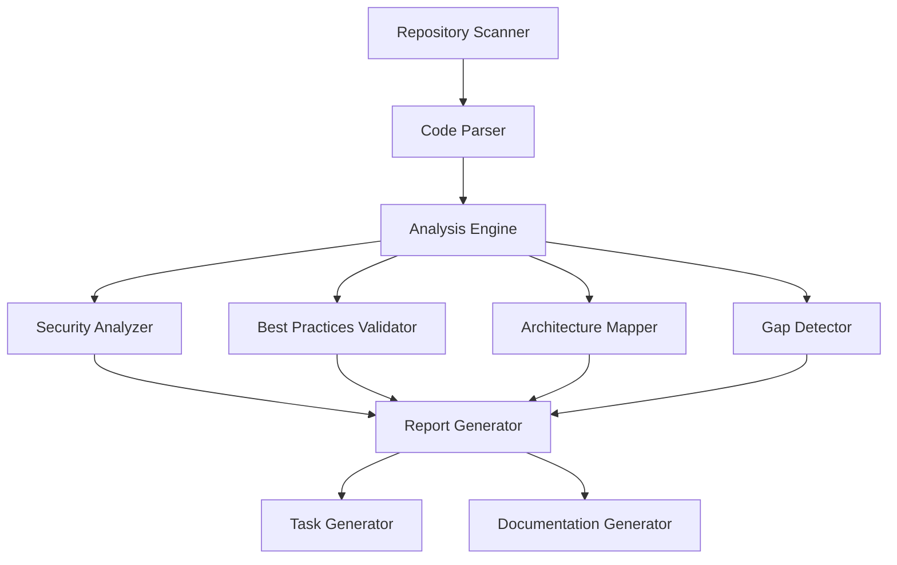

# Design Document: FortiGate Terraform Analysis System

## Overview

The FortiGate Terraform Analysis System is a comprehensive codebase analysis tool designed to examine, understand, and improve the FortiGate Terraform deployment repository. The system combines multiple analysis techniques including static code analysis, security scanning, best practices validation, and architectural assessment to provide actionable insights and improvement recommendations.

The system will analyze Terraform configurations across multiple cloud providers (AWS, Azure, GCP, IBM, OCI, AliCloud, OpenStack), identify deployment patterns, detect security vulnerabilities, and generate comprehensive reports with prioritized improvement tasks.

## Architecture

The system follows a modular architecture with distinct components for different analysis types:



### Core Components

1. **Repository Scanner**: Discovers and catalogs all files in the repository
2. **Code Parser**: Parses Terraform configurations and extracts AST representations
3. **Analysis Engine**: Orchestrates different analysis types and aggregates results
4. **Security Analyzer**: Identifies security vulnerabilities and misconfigurations
5. **Best Practices Validator**: Checks compliance with Terraform and cloud provider best practices
6. **Architecture Mapper**: Maps system architecture and component relationships
7. **Gap Detector**: Identifies missing functionality and inconsistencies
8. **Report Generator**: Creates comprehensive analysis reports
9. **Task Generator**: Generates actionable improvement tasks

## Components and Interfaces

### Repository Scanner

**Purpose**: Discover and catalog all repository contents

**Interface**:
```python
class RepositoryScanner:
    def scan_repository(self, repo_path: str) -> RepositoryInventory
    def get_terraform_files(self) -> List[TerraformFile]
    def get_python_files(self) -> List[PythonFile]
    def get_documentation_files(self) -> List[DocumentationFile]
    def get_cloud_provider_configs(self) -> Dict[str, List[TerraformFile]]
```

**Responsibilities**:
- Recursively scan repository directory structure
- Identify file types (.tf, .py, .md, .txt, etc.)
- Categorize files by cloud provider and deployment scenario
- Extract metadata (file size, modification dates, etc.)

### Code Parser

**Purpose**: Parse Terraform and Python code into analyzable structures

**Interface**:
```python
class CodeParser:
    def parse_terraform_file(self, file_path: str) -> TerraformAST
    def parse_python_file(self, file_path: str) -> PythonAST
    def extract_variables(self, ast: TerraformAST) -> List[Variable]
    def extract_resources(self, ast: TerraformAST) -> List[Resource]
    def extract_modules(self, ast: TerraformAST) -> List[Module]
```

**Implementation Details**:
- Uses HCL parser for Terraform configurations
- Leverages Python AST module for Python scripts
- Extracts variables, resources, outputs, and module references
- Handles syntax errors gracefully with detailed error reporting

### Security Analyzer

**Purpose**: Identify security vulnerabilities and misconfigurations

**Interface**:
```python
class SecurityAnalyzer:
    def analyze_security(self, terraform_files: List[TerraformFile]) -> SecurityReport
    def check_hardcoded_secrets(self, ast: TerraformAST) -> List[SecurityIssue]
    def validate_access_controls(self, resources: List[Resource]) -> List[SecurityIssue]
    def check_encryption_settings(self, resources: List[Resource]) -> List[SecurityIssue]
```

**Security Checks**:
- Hardcoded secrets and credentials
- Overly permissive security groups and firewall rules
- Missing encryption configurations
- Insecure network configurations
- Default passwords and weak authentication
- Public access to sensitive resources

### Best Practices Validator

**Purpose**: Validate adherence to Terraform and cloud provider best practices

**Interface**:
```python
class BestPracticesValidator:
    def validate_practices(self, terraform_files: List[TerraformFile]) -> BestPracticesReport
    def check_naming_conventions(self, resources: List[Resource]) -> List[Issue]
    def validate_module_structure(self, modules: List[Module]) -> List[Issue]
    def check_documentation(self, files: List[TerraformFile]) -> List[Issue]
```

**Validation Areas**:
- Resource naming conventions
- Module organization and reusability
- Variable and output documentation
- State management practices
- Version pinning and dependency management
- Code organization and structure

### Architecture Mapper

**Purpose**: Map system architecture and component relationships

**Interface**:
```python
class ArchitectureMapper:
    def map_architecture(self, terraform_files: List[TerraformFile]) -> ArchitectureMap
    def identify_entry_points(self, modules: List[Module]) -> List[EntryPoint]
    def map_dependencies(self, modules: List[Module]) -> DependencyGraph
    def categorize_deployments(self, files: List[TerraformFile]) -> DeploymentCategories
```

**Mapping Capabilities**:
- Identify main entry points and root modules
- Map module dependencies and data flow
- Categorize deployment scenarios by type and cloud provider
- Document supported FortiGate versions per deployment
- Identify common patterns and reusable components

## Data Models

### Core Data Structures

```python
@dataclass
class TerraformFile:
    path: str
    cloud_provider: str
    deployment_type: str
    fortigate_versions: List[str]
    ast: TerraformAST
    variables: List[Variable]
    resources: List[Resource]
    outputs: List[Output]

@dataclass
class SecurityIssue:
    severity: str  # CRITICAL, HIGH, MEDIUM, LOW
    category: str  # SECRETS, ACCESS_CONTROL, ENCRYPTION, NETWORK
    description: str
    file_path: str
    line_number: int
    recommendation: str
    cwe_id: Optional[str]

@dataclass
class AnalysisReport:
    repository_inventory: RepositoryInventory
    security_issues: List[SecurityIssue]
    best_practice_violations: List[BestPracticeIssue]
    architecture_map: ArchitectureMap
    gap_analysis: GapAnalysis
    improvement_tasks: List[ImprovementTask]
    metrics: AnalysisMetrics

@dataclass
class ImprovementTask:
    id: str
    title: str
    description: str
    priority: str  # HIGH, MEDIUM, LOW
    effort: str    # SMALL, MEDIUM, LARGE
    category: str  # SECURITY, BEST_PRACTICES, ARCHITECTURE, DOCUMENTATION
    requirements_reference: str
    implementation_steps: List[str]
    validation_criteria: List[str]
```

### Cloud Provider Models

```python
@dataclass
class CloudProviderConfig:
    provider: str  # aws, azure, gcp, ibm, oci, alicloud, openstack
    deployment_scenarios: List[str]
    supported_versions: List[str]
    specific_features: List[str]
    configuration_files: List[str]

@dataclass
class DeploymentScenario:
    name: str
    description: str
    cloud_providers: List[str]
    architecture_type: str  # single, ha, load_balancer, gwlb, transit_gateway
    complexity: str
    use_cases: List[str]
```

## Correctness Properties

*A property is a characteristic or behavior that should hold true across all valid executions of a system-essentially, a formal statement about what the system should do. Properties serve as the bridge between human-readable specifications and machine-verifiable correctness guarantees.*

Let me analyze the acceptance criteria to determine which ones are testable as properties:

### Property 1: Comprehensive File Discovery
*For any* repository containing Terraform configurations, Python scripts, and documentation files, the system should discover and catalog all files of each type without missing any
**Validates: Requirements 1.1, 1.2, 1.3**

### Property 2: Configuration Categorization
*For any* repository with multi-cloud Terraform configurations, the system should correctly categorize all configurations by cloud provider, deployment type, and supported FortiGate versions
**Validates: Requirements 1.4, 1.5, 2.3**

### Property 3: Architecture Mapping Completeness
*For any* Terraform configuration set, the system should identify all entry points, map all module dependencies, and detect all common patterns present in the codebase
**Validates: Requirements 2.1, 2.2, 2.4, 2.5**

### Property 4: Issue Detection Comprehensiveness
*For any* Terraform configuration with known security vulnerabilities, syntax errors, logic errors, anti-patterns, or best practice violations, the system should detect and flag all such issues
**Validates: Requirements 3.1, 3.2, 3.3, 3.4, 3.5**

### Property 5: Best Practices Validation
*For any* Terraform configuration, the system should validate all aspects of best practices including naming conventions, variable usage, security practices, module organization, and documentation completeness
**Validates: Requirements 4.1, 4.2, 4.3, 4.4, 4.5**

### Property 6: Report Generation Completeness
*For any* completed analysis, the system should generate comprehensive reports that include complete inventory, properly categorized findings, specific recommendations, quality metrics, and actionable tasks
**Validates: Requirements 5.1, 5.2, 5.3, 5.4, 5.5**

### Property 7: Multi-Cloud Validation
*For any* cloud provider configuration (AWS, Azure, GCP, etc.), the system should perform provider-specific validation and identify cross-provider inconsistencies
**Validates: Requirements 6.1, 6.2, 6.3, 6.4, 6.5**

### Property 8: Version Compatibility Analysis
*For any* FortiGate configuration, the system should correctly identify version compatibility, detect version conflicts, validate version-specific features, identify upgrade issues, and provide version guidance
**Validates: Requirements 7.1, 7.2, 7.3, 7.4, 7.5**

### Property 9: Task Management System
*For any* identified issues and improvements, the system should generate specific implementable tasks, prioritize them by impact and effort, provide detailed implementation steps, enable progress tracking, and organize them into logical phases
**Validates: Requirements 8.1, 8.2, 8.3, 8.4, 8.5**

## Error Handling

The system implements comprehensive error handling across all components:

### File System Errors
- **Repository Access**: Handle cases where repository is inaccessible or corrupted
- **File Reading**: Gracefully handle permission errors, corrupted files, or encoding issues
- **Large Files**: Implement streaming for large configuration files to prevent memory issues

### Parsing Errors
- **Syntax Errors**: Continue analysis when individual files have syntax errors, report errors with context
- **Invalid HCL**: Handle malformed Terraform configurations with detailed error reporting
- **Encoding Issues**: Support multiple file encodings and handle conversion errors

### Analysis Errors
- **Missing Dependencies**: Handle cases where module dependencies are not available
- **Circular Dependencies**: Detect and report circular module dependencies
- **Invalid Configurations**: Continue analysis when configurations are semantically invalid

### External Tool Integration
- **Tool Failures**: Handle failures of external security scanning tools gracefully
- **Version Compatibility**: Handle cases where external tools don't support certain Terraform versions
- **Network Issues**: Handle network failures when downloading external resources

### Recovery Strategies
- **Partial Analysis**: Continue analysis even when some components fail
- **Fallback Methods**: Use alternative analysis methods when primary methods fail
- **Progress Preservation**: Save analysis progress to enable resumption after failures

## Testing Strategy

The testing strategy employs a dual approach combining unit tests for specific scenarios and property-based tests for comprehensive validation.

### Unit Testing Approach

Unit tests focus on specific examples, edge cases, and integration points:

**Component Testing**:
- Test individual parsers with known good and bad configurations
- Test security analyzers with specific vulnerability patterns
- Test report generators with various input combinations

**Edge Case Testing**:
- Empty repositories and single-file repositories
- Configurations with circular dependencies
- Files with various encoding issues
- Extremely large configuration files

**Integration Testing**:
- End-to-end analysis workflows
- External tool integration points
- Error recovery scenarios

### Property-Based Testing Configuration

Property-based tests validate universal properties across all inputs using **Hypothesis** for Python:

**Test Configuration**:
- Minimum 100 iterations per property test
- Custom generators for Terraform configurations, repository structures, and cloud provider patterns
- Shrinking enabled to find minimal failing examples

**Property Test Implementation**:
Each correctness property will be implemented as a separate property-based test with the following tag format:
- **Feature: fortigate-terraform-analysis, Property {number}: {property_text}**

**Generator Strategy**:
- **Repository Generator**: Creates valid repository structures with various file types
- **Terraform Generator**: Generates syntactically valid Terraform configurations
- **Security Issue Generator**: Creates configurations with known security patterns
- **Multi-Cloud Generator**: Generates configurations for different cloud providers

**Property Test Examples**:

```python
@given(repository_with_terraform_files())
def test_file_discovery_completeness(repo):
    """Feature: fortigate-terraform-analysis, Property 1: Comprehensive File Discovery"""
    scanner = RepositoryScanner()
    result = scanner.scan_repository(repo.path)
    
    expected_tf_files = count_terraform_files(repo)
    assert len(result.terraform_files) == expected_tf_files

@given(terraform_configurations_with_known_issues())
def test_issue_detection_comprehensiveness(configs):
    """Feature: fortigate-terraform-analysis, Property 4: Issue Detection Comprehensiveness"""
    analyzer = SecurityAnalyzer()
    result = analyzer.analyze_security(configs)
    
    # Verify all known issues are detected
    for known_issue in configs.known_issues:
        assert any(issue.matches(known_issue) for issue in result.issues)
```

### Test Coverage Requirements

- **Unit Test Coverage**: Minimum 90% line coverage for all core components
- **Property Test Coverage**: All correctness properties must have corresponding property tests
- **Integration Test Coverage**: All major workflows and error scenarios
- **Performance Test Coverage**: Large repository handling and memory usage validation

### Continuous Testing

- **Pre-commit Hooks**: Run fast unit tests and linting before commits
- **CI Pipeline**: Full test suite including property tests on all pull requests
- **Nightly Testing**: Extended property test runs with higher iteration counts
- **Performance Regression Testing**: Monitor analysis performance on large repositories