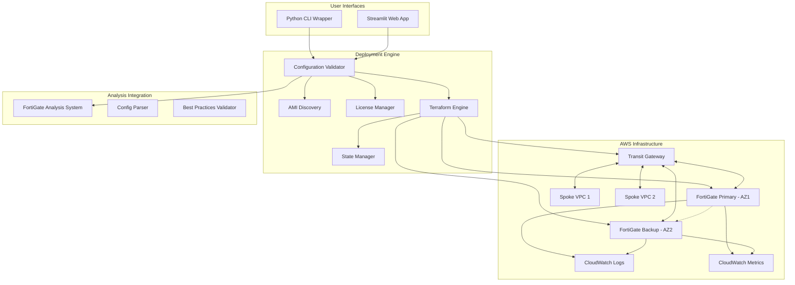

# FortiGate AWS HA Deployment - Complete Solution Overview

## 🎯 **Project Summary**

The FortiGate AWS HA Deployment is a comprehensive infrastructure-as-code solution that automates the deployment of highly available FortiGate firewall pairs on AWS in a hub-and-spoke architecture. The system integrates with the existing FortiGate Terraform Analysis System for validation and provides both CLI and web-based interfaces for deployment management.

## 🏗️ **Architecture Overview**

### **Network Architecture**
```
Internal VPC Subnets → Transit Gateway → FortiGate HA Pair → Internet
                                      ↓
                              BGP Route Exchange
                                      ↓
                            Automatic HA Failover
```

### **System Components**


## 🚀 **Key Features Implemented**

### **1. Hub-and-Spoke Architecture**
- **Traffic Flow**: Internal VPC subnet → Transit Gateway → FortiGate → Internet
- **BGP Routing**: Dynamic route exchange between FortiGates and Transit Gateway
- **HA Failover**: Automatic primary/backup failover with BGP session migration
- **Multi-AZ Deployment**: FortiGates deployed across different availability zones

### **2. 4-Interface Configuration**
- **OUTSIDE Interface**: Internet-facing interface for outbound traffic
- **INSIDE Interface**: Internal interface connected to Transit Gateway
- **HA Interface**: High availability synchronization between FortiGates
- **MGMT Interface**: Management interface for administrative access

### **3. Pre-assigned Resource Support**
- **VPC Integration**: Uses existing VPC provided by network team
- **Subnet Management**: References pre-assigned subnets across 2 AZs
- **ENI Attachment**: Attaches to pre-configured Elastic Network Interfaces
- **Transit Gateway**: Supports both new and existing Transit Gateway

### **4. AMI Discovery and Management**
- **Automatic Discovery**: Finds latest FortiGate AMIs by version and license type
- **Version Support**: Supports FortiGate 6.2, 6.4, 7.0, 7.2, 7.4, 7.6
- **License Types**: BYOL, OnDemand (PAYG), and Reserved instances
- **Regional Support**: Works across all AWS regions with FortiGate AMIs

### **5. Comprehensive Licensing Support**

#### **BYOL (Bring Your Own License)**
- **AWS Secrets Manager**: Secure license storage (recommended)
- **S3 Storage**: Alternative license storage option
- **License Validation**: Validates FortiGate license file format
- **Cost Efficiency**: Only EC2 costs (~$0.192/hour per c5.xlarge)

#### **OnDemand (Pay-As-You-Go)**
- **No License Files**: Licensing included in hourly fee
- **AWS Marketplace**: Automatic subscription handling
- **Quick Setup**: No license management required
- **Cost**: EC2 + licensing (~$0.69-1.19/hour per instance)

#### **Reserved Instance**
- **Long-term Commitment**: Upfront payment for reduced rates
- **Cost Optimization**: Best for production deployments >6 months
- **Predictable Costs**: Fixed pricing model

### **6. Interactive Deployment Interfaces**

#### **Python CLI Wrapper**
- **Interactive Prompts**: Guides users through all configuration parameters
- **AMI Auto-Discovery**: Automatically finds suitable FortiGate AMIs
- **License Setup**: Integrates with license management systems
- **Validation**: Comprehensive pre-deployment validation
- **Plan Generation**: Creates Terraform plans without auto-deployment

#### **Streamlit Web Application**
- **Web-based Interface**: User-friendly graphical interface
- **Real-time Progress**: Live deployment progress tracking
- **Architecture Visualization**: Interactive network diagrams
- **Parameter Forms**: Web forms for configuration input
- **Status Dashboard**: Deployment status and health monitoring

### **7. Analysis System Integration**
- **Security Validation**: Leverages FortiGate Terraform Analysis System
- **Best Practices**: Validates configurations against security best practices
- **Pre-deployment Checks**: Prevents deployment of insecure configurations
- **Compliance Reporting**: Generates security and compliance reports

### **8. Comprehensive Monitoring and Logging**

#### **VPC Flow Logs**
- **Network Traffic**: Captures all network traffic flows
- **Security Analysis**: Enables traffic pattern analysis
- **Troubleshooting**: Detailed packet-level information
- **Retention**: Configurable log retention periods

#### **CloudWatch Integration**
- **FortiGate Metrics**: CPU, memory, network utilization
- **Custom Dashboards**: Pre-configured monitoring dashboards
- **Alerting**: Automated alerts for critical events
- **Log Aggregation**: Centralized log collection and analysis

#### **FortiGate Security Logs**
- **Traffic Inspection**: Detailed security event logging
- **Policy Violations**: Firewall rule violation tracking
- **Threat Detection**: Security threat identification
- **Audit Trail**: Complete audit trail for compliance

### **9. Idempotent Deployment with Rollback**
- **State Management**: Terraform remote state with locking
- **Rollback Capability**: Safe rollback to previous stable state
- **Error Recovery**: Comprehensive error handling and recovery
- **Plan Validation**: Generate and review plans before deployment

### **10. Security and Compliance**
- **Least-Privilege Access**: Minimal required IAM permissions
- **Encrypted Storage**: Encrypted Terraform state and license storage
- **Network Security**: Security groups with deny-by-default rules
- **Audit Logging**: Complete audit trail for all operations

## 📁 **Project Structure**

```
fortigate-aws-ha-deployment/
├── README.md                           # Project overview
├── COMPLETE_SOLUTION_OVERVIEW.md       # This document
├── AMI_AND_LICENSING_GUIDE.md          # AMI and licensing guide
├── USAGE.md                            # Detailed usage instructions
├── MONITORING_AND_TROUBLESHOOTING.md   # Monitoring guide
├── STREAMLIT_APP_GUIDE.md              # Web app instructions
├── requirements.txt                    # Python dependencies
├── config-example.yaml                 # Example configuration
├── deploy.py                           # Main deployment script
├── setup-licensing.py                  # License setup helper
├── web-app.py                          # Streamlit web application
├── terraform/                          # Terraform infrastructure
│   ├── main.tf                         # Root module
│   ├── variables.tf                    # Input variables
│   ├── outputs.tf                      # Output values
│   ├── terraform.tfvars.example        # Example variables
│   └── modules/                        # Terraform modules
│       ├── fortigate-ha/               # FortiGate HA module
│       ├── transit-gateway/            # Transit Gateway module
│       ├── security/                   # Security groups module
│       └── monitoring/                 # CloudWatch monitoring
├── docs/                               # Additional documentation
├── tests/                              # Test suites
└── .kiro/specs/fortigate-aws-ha-deployment/
    ├── requirements.md                 # Project requirements
    ├── design.md                       # System design
    └── tasks.md                        # Implementation tasks
```

## 🛠️ **Implementation Components**

### **1. Terraform Infrastructure Modules**

#### **FortiGate HA Module** (`terraform/modules/fortigate-ha/`)
- **EC2 Instances**: Primary and backup FortiGate VMs
- **Network Interfaces**: 4 ENIs per instance (OUTSIDE, INSIDE, HA, MGMT)
- **HA Configuration**: Automatic failover configuration
- **BGP Setup**: Dynamic routing with Transit Gateway
- **Security Policies**: Traffic inspection and filtering rules

#### **Transit Gateway Module** (`terraform/modules/transit-gateway/`)
- **TGW Creation**: Optional Transit Gateway creation
- **Route Tables**: Hub-and-spoke routing configuration
- **BGP Sessions**: eBGP peering with FortiGates
- **Spoke Attachments**: VPC attachment management

#### **Security Module** (`terraform/modules/security/`)
- **Security Groups**: Least-privilege access rules
- **Network ACLs**: Additional layer of network security
- **IAM Roles**: Service roles for FortiGate instances
- **Key Management**: SSH key pair management

#### **Monitoring Module** (`terraform/modules/monitoring/`)
- **VPC Flow Logs**: Network traffic logging
- **CloudWatch Dashboards**: Pre-configured monitoring dashboards
- **Log Groups**: Centralized log collection
- **Alarms**: Automated alerting for critical events

### **2. Python Deployment Engine**

#### **Core Classes**
- **DeploymentEngine**: Main orchestrator for deployments
- **ConfigurationValidator**: Validates AWS resources and parameters
- **AMIDiscovery**: Discovers and validates FortiGate AMIs
- **LicenseManager**: Manages BYOL license retrieval and validation
- **TerraformManager**: Handles Terraform operations and state

#### **Configuration Models**
- **DeploymentConfig**: Complete deployment configuration
- **NetworkConfig**: VPC, subnet, and network parameters
- **FortiGateConfig**: FortiGate instance and licensing configuration
- **TransitGatewayConfig**: Transit Gateway and BGP parameters
- **MonitoringConfig**: Logging and monitoring settings

### **3. Streamlit Web Application**

#### **Features**
- **Interactive Forms**: Web-based parameter input
- **Real-time Progress**: Live deployment status updates
- **Architecture Diagrams**: Visual network topology
- **Configuration Management**: Save and load configurations
- **Error Handling**: User-friendly error messages and recovery

#### **Components**
- **Main Dashboard**: Deployment overview and status
- **Configuration Forms**: Step-by-step parameter input
- **Progress Tracking**: Real-time deployment progress
- **Monitoring Views**: Live metrics and log viewing
- **Architecture Visualization**: Interactive network diagrams

### **4. License Management System**

#### **setup-licensing.py Script**
- **Secrets Manager Integration**: Upload licenses to AWS Secrets Manager
- **S3 Integration**: Alternative S3-based license storage
- **License Validation**: Validates FortiGate license file format
- **AMI Discovery**: Lists available FortiGate AMIs
- **IAM Policy Generation**: Creates required IAM policies

#### **Supported Storage Options**
- **AWS Secrets Manager**: Encrypted, managed secret storage
- **S3 Buckets**: Encrypted S3 object storage
- **Local Files**: Development and testing scenarios

## 💰 **Cost Analysis**

### **Licensing Cost Comparison (Per Instance)**

| License Type | EC2 Cost/Hour | License Cost/Hour | Total/Hour | Monthly Cost | Best For |
|--------------|---------------|-------------------|------------|--------------|----------|
| BYOL | $0.192 | $0.00 | $0.192 | $138 | Long-term, existing licenses |
| OnDemand | $0.192 | $0.50-1.00 | $0.69-1.19 | $497-857 | Testing, short-term |
| Reserved (1yr) | $0.192 | $0.30-0.50 | $0.49-0.69 | $353-497 | Production, >6 months |

*Costs are approximate for c5.xlarge instances in us-east-1*

### **Total Solution Cost (2 Instances)**

| License Type | Monthly Cost | Annual Cost | Break-even Point |
|--------------|--------------|-------------|------------------|
| BYOL | $276 | $3,312 | Immediate (if you have licenses) |
| OnDemand | $994-1,714 | $11,928-20,568 | N/A |
| Reserved | $706-994 | $8,472-11,928 | 6-8 months |

### **Additional AWS Costs**
- **Transit Gateway**: $36/month + $0.02/GB processed
- **VPC Flow Logs**: $0.50/GB ingested
- **CloudWatch Logs**: $0.50/GB ingested, $0.03/GB stored
- **Data Transfer**: $0.09/GB outbound to internet

## 🔧 **Deployment Options**

### **1. Interactive CLI Deployment**
```bash
# Full interactive deployment with AMI discovery
python deploy.py

# Auto-discover AMI with specific parameters
python deploy.py --auto-discover-ami --license-type BYOL --fortigate-version 7.4

# Plan-only mode for review
python deploy.py --plan-only
```

### **2. Configuration File Deployment**
```bash
# Use pre-configured YAML file
python deploy.py --config production-config.yaml

# Generate plan from configuration
python deploy.py --config production-config.yaml --plan-only
```

### **3. Web Application Deployment**
```bash
# Start Streamlit web application
streamlit run web-app.py --server.port 8501

# Access web interface at http://localhost:8501
```

### **4. License Setup (BYOL)**
```bash
# Set up licenses in AWS Secrets Manager
python setup-licensing.py secrets-manager \
  --primary-license ./primary.lic \
  --backup-license ./backup.lic

# Set up licenses in S3
python setup-licensing.py s3 \
  --primary-license ./primary.lic \
  --backup-license ./backup.lic \
  --bucket my-licenses --create-bucket
```

## 📊 **Monitoring and Troubleshooting**

### **Available Monitoring Data**

#### **VPC Flow Logs**
- **Source/Destination IPs**: Traffic flow analysis
- **Ports and Protocols**: Application traffic identification
- **Accept/Reject Status**: Security policy effectiveness
- **Packet and Byte Counts**: Traffic volume analysis

#### **CloudWatch Metrics**
- **EC2 Metrics**: CPU, memory, network utilization
- **Custom Metrics**: FortiGate-specific performance data
- **Transit Gateway Metrics**: Routing and attachment status
- **Application Metrics**: Traffic throughput and latency

#### **FortiGate Security Logs**
- **Traffic Logs**: Detailed connection information
- **Security Events**: Threat detection and blocking
- **System Logs**: FortiGate system events and errors
- **HA Status**: High availability status and failover events

### **Troubleshooting Tools**
- **CloudWatch Dashboards**: Pre-configured monitoring views
- **Log Insights**: Advanced log querying and analysis
- **VPC Flow Log Analysis**: Network traffic investigation
- **FortiGate CLI Access**: Direct device troubleshooting

## 🔒 **Security Features**

### **Network Security**
- **Security Groups**: Least-privilege firewall rules
- **Network ACLs**: Subnet-level access control
- **Private Subnets**: Internal traffic isolation
- **NAT Gateway**: Secure outbound internet access

### **Data Security**
- **Encrypted Storage**: Terraform state and license encryption
- **Secrets Management**: AWS Secrets Manager integration
- **IAM Roles**: Service-specific access permissions
- **Audit Logging**: Complete operation audit trail

### **Operational Security**
- **Configuration Validation**: Pre-deployment security checks
- **Best Practices**: Automated compliance validation
- **Access Control**: Role-based access management
- **Change Tracking**: Infrastructure change monitoring

## 🎯 **Use Cases**

### **1. Enterprise Hub-and-Spoke**
- **Centralized Security**: All traffic inspected through FortiGates
- **Multi-VPC Architecture**: Multiple spoke VPCs for different applications
- **Compliance**: Meets regulatory requirements for traffic inspection
- **Scalability**: Easy addition of new spoke VPCs

### **2. Hybrid Cloud Connectivity**
- **On-premises Integration**: VPN connectivity through FortiGates
- **Cloud Migration**: Secure migration path for applications
- **Consistent Security**: Same security policies across environments
- **Centralized Management**: Single pane of glass for security

### **3. Multi-Tenant Environments**
- **Tenant Isolation**: Separate VPCs for different tenants
- **Shared Security**: Common security infrastructure
- **Cost Optimization**: Shared FortiGate infrastructure
- **Policy Enforcement**: Consistent security policies

### **4. Development and Testing**
- **Environment Isolation**: Separate dev/test/prod environments
- **Cost Control**: OnDemand licensing for temporary environments
- **Rapid Deployment**: Quick environment provisioning
- **Consistent Configuration**: Same setup across environments

## 📈 **Scalability and Performance**

### **Horizontal Scaling**
- **Additional Spoke VPCs**: Easy addition of new VPCs
- **Multiple FortiGate Pairs**: Scale-out architecture support
- **Load Distribution**: Traffic distribution across instances
- **Geographic Distribution**: Multi-region deployments

### **Vertical Scaling**
- **Instance Types**: Support for various EC2 instance sizes
- **Performance Tiers**: Different throughput capabilities
- **Resource Optimization**: Right-sizing based on requirements
- **Cost Optimization**: Performance vs. cost balance

### **Performance Characteristics**
- **Throughput**: Up to 10 Gbps per FortiGate instance
- **Latency**: Sub-millisecond inspection latency
- **Concurrent Sessions**: Millions of concurrent connections
- **High Availability**: 99.9% uptime with proper configuration

## 🔄 **Maintenance and Updates**

### **Automated Updates**
- **AMI Discovery**: Automatic latest AMI identification
- **Security Patches**: Regular FortiGate updates
- **Terraform Updates**: Infrastructure code maintenance
- **Dependency Management**: Python package updates

### **Backup and Recovery**
- **State Backups**: Terraform state backup and recovery
- **Configuration Backups**: FortiGate configuration backups
- **Disaster Recovery**: Multi-AZ deployment for resilience
- **Rollback Procedures**: Safe rollback to previous versions

### **Monitoring and Alerting**
- **Health Checks**: Automated health monitoring
- **Performance Alerts**: Threshold-based alerting
- **Security Alerts**: Security event notifications
- **Operational Alerts**: System status notifications

## 🎓 **Getting Started**

### **Prerequisites**
1. **AWS Account**: With appropriate permissions
2. **FortiGate Licenses**: For BYOL deployments
3. **Network Planning**: VPC and subnet design
4. **Key Pairs**: SSH access keys

### **Quick Start Steps**
1. **Clone Repository**: Get the deployment code
2. **Install Dependencies**: Python packages and Terraform
3. **Configure AWS**: Set up AWS credentials and region
4. **Set Up Licenses**: Configure BYOL licenses (if applicable)
5. **Run Deployment**: Execute interactive or configuration-based deployment
6. **Verify Deployment**: Check FortiGate status and connectivity
7. **Configure Monitoring**: Set up dashboards and alerts

### **Next Steps**
1. **Review Documentation**: Read all provided guides
2. **Test Deployment**: Verify traffic flows and failover
3. **Configure Monitoring**: Set up comprehensive monitoring
4. **Implement Automation**: Integrate with CI/CD pipelines
5. **Plan Scaling**: Design for future growth requirements

This complete solution provides a production-ready, enterprise-grade FortiGate HA deployment system with comprehensive automation, monitoring, and management capabilities.